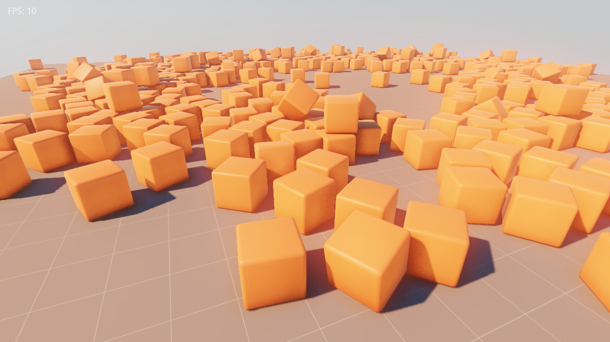

# Newton for Dagon 
[Newton Game Dynamics 3.14](https://github.com/MADEAPPS/newton-dynamics) integration into [Dagon](https://github.com/gecko0307/dagon). Uses [bindbc-newton](https://github.com/gecko0307/bindbc-newton). It will eventually replace dmech as default physics engine in Dagon.

Work in progress! Supported features include:
* Creating worlds, dynamic and static bodies
* Bodies are attached to Dagon entities as EntityComponents
* Sphere and box collision shapes (more to be added soon)
* Static meshes
* Adding forces and torques to bodies, setting velocity
* Creating body group ids
* Ray casting

